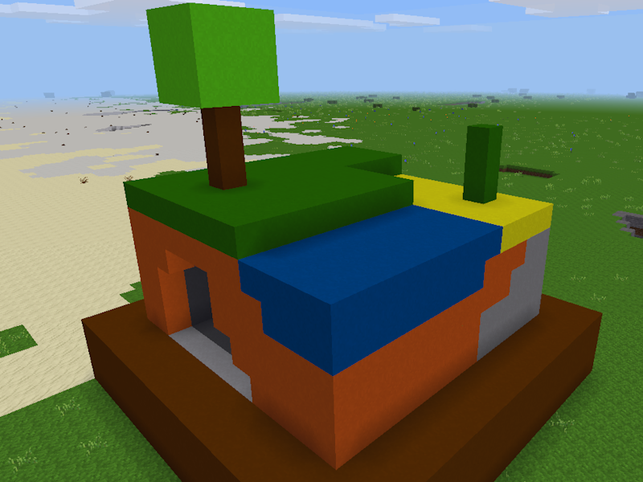
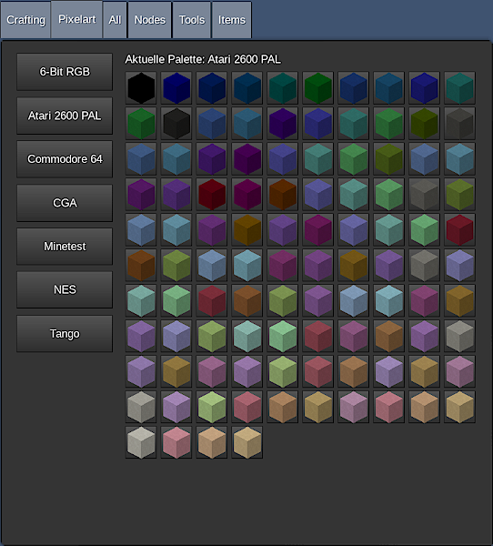

**_Pixelart_ is a mod adding nodes grouped in color palettes to Minetest**



## Using the Mod

The mod operates in two ways. In creative mode a player can take pixel (nodes) from the palette and place them in the world without any cost.



When the world does not run in creative mode taking pixels costs a base node. The name of the base node is shown to the player via a chat line. When a player has one of the defined base node taking out one pixel (node) from the palette is possible.

In both cases the player needs at least one free inventory slot where the node can be placed in.

The selector can be accessed via the sfinv page as shown above but there are also a custom *Unified Inventory* page as well as a node. The node is crafted by red, blue, green, and yellow wool in a square.

If the node formspec looks super weird (massive spaces, large buttons, pixels overlapping or have large gaps, etc.) make sure you’re running at least Minetest 5.1.0 because the mod uses the new formspec version for the node. The sfinv page and the Unified Inventory page are not affected.

## Built-in Palettes

The built-in palettes all use *Silver Sandstone* as base node (`default:silver_sandstone`) when not in creative mode. All palettes are carefully created using original sources.

Feel free to report mistakes or suggest new palettes by [creating an issue](https://gitlab.com/4w/pixelart/issues/new).

## Custom Palettes

The mod allows using custom palettes on a per-world basis. Those custom palettes take precedence over the built-in palettes when having the same name as them. This allows overriding built-in palettes as well as removing them from the palettes list.

A palette file is a Lua file returning a table. The table contains a minimum of three two entries. The `name` defines the title/name of the palette. It should be as short as possible and won’t be translated. The `base_node` entry defines what node a player needs to have to get a pixel from the given palette when not in creative mode. And `pixels` holds the PixelSpecs.

Custom palettes are stored in `./worlds/worlddirectory/_pixelart/palettes` and adding/removing/changing a custom palette needs a restart of the server.

### PixelSpec Definition

The `pixels` entry is a table containing all PixelSpecs for the palette. There is a maximum of 128 possible PixelSpecs per palette. Keep in mind that for each color one node will be registered. So having a 128 colors palette this palette alone registers 128 nodes. A PixelSpec is either a hexadecimal value prefixed with `#` or a table containing various values.

This is the simplest PixelSpec just defining the color itself and leaving all other values at their palette default values.

```lua
'#729fcf'
```

The next definition is a full PixelSpec setting all the currently possible values specific for the pixel (node) that will be generated from it.

```lua
{
    color = '#729fcf',     -- Mandatory color definition
    name = 'My Cool Name', -- Optional name for the created pixel (node)
    opacity = 200,         -- Optional opacity different from default opacity
}
```

The opacity and the name are not parts of the resulting node IDs. So when adding multiple PixelSpecs with the same color in the same palette, but using different opacity values only the last defined PixelSpec is being used.

### Example Palette Code

```lua
return {
    name = 'My Cool Palette',
    base_node = 'default:silver_sandstone',
    -- Optional default opacity value
    -- default_opacity = 200,
    pixels = {
        '#000001',
        { color = '#729fcf', opacity = 128 },
        '#000003',
        -- more colors
        '#000128'
    }
}
```

### Overridding Palettes Using Custom Palettes

For overriding a built-in palette simply return a table containing an empty `pixels` table.

```lua
return {
    pixels = {}
}
```

All custom palettes that do not provide any colors are not shown. When a custom palette overrides a built-in palette and the custom palette is “empty” the built-in palette is removed from the palettes list. To restore it, simply remove or rename the custom palette file.

### Customizing Existing Palettes

Instead of creating or replacing exiting palettes it is also possible to customize palettes on a per-world basis.

It is possible to customize built-in palettes as well as custom palettes. All customization files go to `./worlds/worlddirectory/_pixelart/customization`. The file name is the palette’s file name you want to modify. If an invalid file name (`id.lua`) is used Minetest crashes on startup.

Palette customization files are returning a table structured as shown below.

```lua
return {
    base_node = 'default:cobble',
    name = 'Modified',
    default_opacity = 100,
    pixels = {
        ['#00ff00'] = {
            name = 'Green',
            opacity = 255
        },
        ['#ff0000'] = {
            name = 'Red',
        }
    }
}
```

Except the `pixels` entry this is similar to the palette definition. Values can be omitted. Only values that are used will be changed.

The `pixels` entry is a table with named entries. The names for the entries are the color names you want to modify. The named entries are tables that set the values that can be set in a PixelSpec except the color itself.

The colors of existing palettes can’t be changed with this functionality. This is intended because palettes are artistic works. If you want to have different colors in a palette you need to create a custom palette.

# Node Formspec Looks Weird

If the node formspec looks super weird (massive spaces, large buttons, pixels overlapping or have large gaps, etc.) you’re running an outdated version of Minetest. You need at least 5.1.0 to pproperly run the mod because it uses the new formspec version for the node. The sfinv page and the Unified Inventory page are not affected. They use the “version 1” code.
